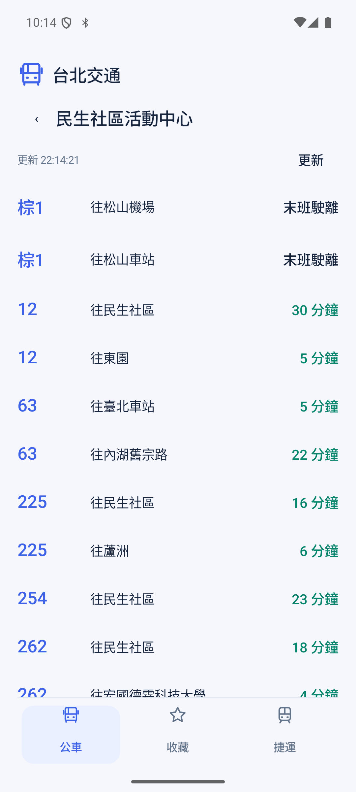
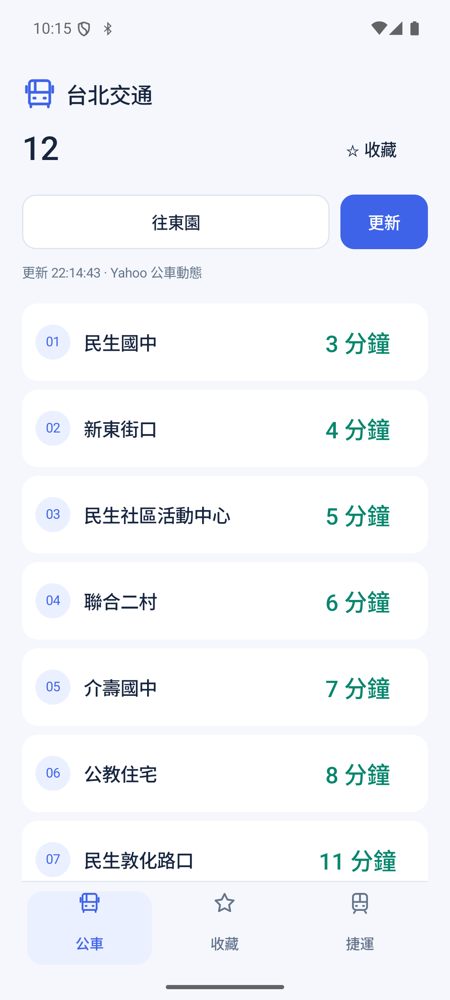

# 台北交通

查公車、找站牌，也能查台北捷運票價與旅程時間。支援台北、新北，介面簡潔，沒有廣告，也不需要定位權限。

## 下載安裝

前往 **[最新版本](https://github.com/plateaukao/transportation/releases/latest)**，下載 `transportation-*.apk`，在 Android 手機上開啟安裝。第一次安裝時，系統可能會請你允許該瀏覽器或檔案管理程式「安裝未知應用程式」。

支援 **Android 10 以上**。更新時直接安裝新版 APK，即可保留收藏、最近搜尋與已選方向。

## 找路線，或找站牌

搜尋列右側的圖示就是搜尋模式：**公車圖示找路線，站牌圖示找站牌**，點一下即可切換。輸入前不顯示整份清單；有輸入時才出現清除按鈕。

- **找路線**：輸入路線號碼或目的地，點選路線查看各站到站時間。
- **找站牌**：輸入站名，點選站牌查看所有行經路線，各方向分別顯示到站時間。

| 搜尋公車路線 | 站牌的行經路線與到站時間 |
| --- | --- |
|  |  |

## 看動態、切方向

開啟路線就會取得預估到站時間。點選方向按鈕切換去返程；想看最新動態時，按 **更新**。每條路線會記住你上次選擇的方向。

往下捲動時，標題與底部頁籤會收起，讓站點清單有更多空間；更新時間仍保留在上方。未發車、末班駛離等狀態會直接顯示。

## 查捷運票價與旅程時間

在 **捷運** 頁籤選擇出發站、到達站，即可查看單程全票、優惠票參考與預估旅程時間。中間的交換按鈕可對調起終點。這是站間旅程時間，**不是下一班列車的到站倒數**。

| 公車路線的各站動態 | 捷運票價與旅程時間 |
| --- | --- |
|  |  |

## 收藏與主畫面捷徑

- 在路線頁面點 **收藏**，之後可從 **收藏** 頁籤快速開啟。
- **長按路線標題**，建立主畫面捷徑，直接開啟該路線與當時的方向。
- **長按站牌搜尋結果或站牌頁面的標題**，建立站牌捷徑，直接查看該站所有行經路線的到站時間。
- 路線捷徑的圖示顯示路線名稱；站牌捷徑顯示站名前兩個字，例如「民生」。完整站名保留在捷徑名稱中，實際顯示長度依主畫面設定而定。
- 點選空白搜尋列，可再選擇最近搜尋過的內容。

## 資料與使用提醒

路線、站牌與捷運票價查詢使用內建資料，離線也能搜尋；公車到站動態需要網路。動態會在開啟路線／站牌或按下更新時取得，不會自動倒數更新。預估時間僅供參考，請提前到站候車。

同名站牌可能分布在不同道路側或位置，請確認顯示的行車方向。內建資料日期為 **2026-10-01**，實際路線、票價與服務狀態以業者公告為準。資料來源為 Yahoo 交通服務；本 App 為非官方交通查詢工具。

## 回報問題

找不到站牌、動態顯示異常，或有介面建議，歡迎到 **[Issues](https://github.com/plateaukao/transportation/issues)** 回報。請附上路線／站名、Android 版本與問題畫面，方便確認。

想自行編譯或了解實作，請參考 [開發說明](docs/DEVELOPING.md)。
